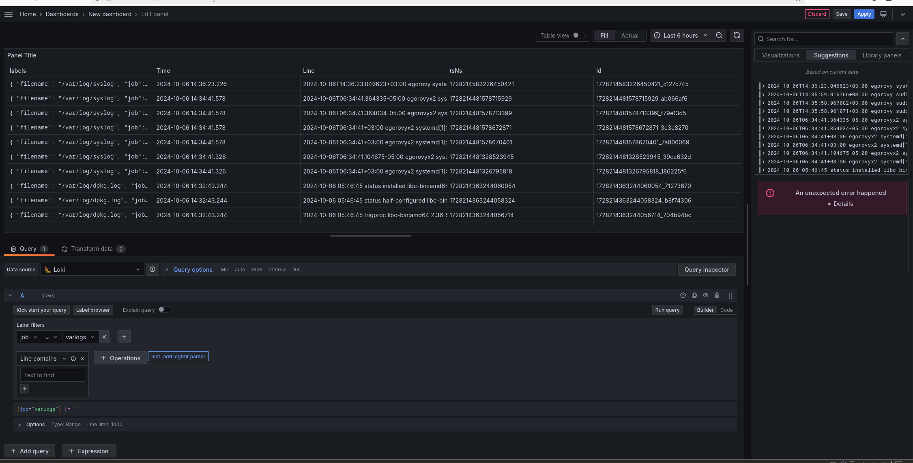

# План выполнения работы по дисциплине "Система для сбора событий и логов"

## Работу выполнил Егоров Юрий Александрович, студент группы ББМО-01-23

## 1. Создание двух виртуальных машин на базе ОС Debian 12

## 2. Настройка сетевого обмена между виртуальными машинами

## 3. Настройка передачи логов с первой ВМ на вторую с использованием rsyslog

## 4. Установка и настройка Loki для получения логов на сервере

## 5. Установка и настройка Loki с использованием Signoz

