# Практическая работа № 4: Network Threat Hunting
## Выполнил Егоров Юрий Александрович, группа ББМО-01-23
### Развернем тестовую VM 

### Войти в лабораторию 
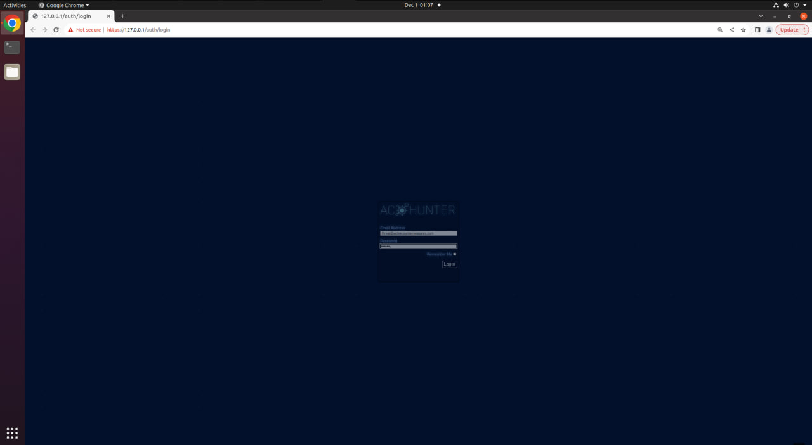
### Экспортивровать базу данных 
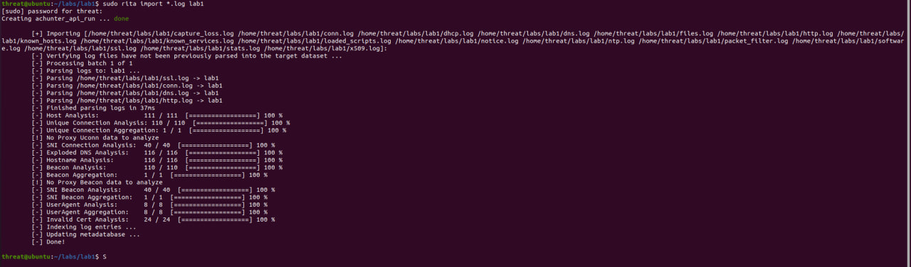
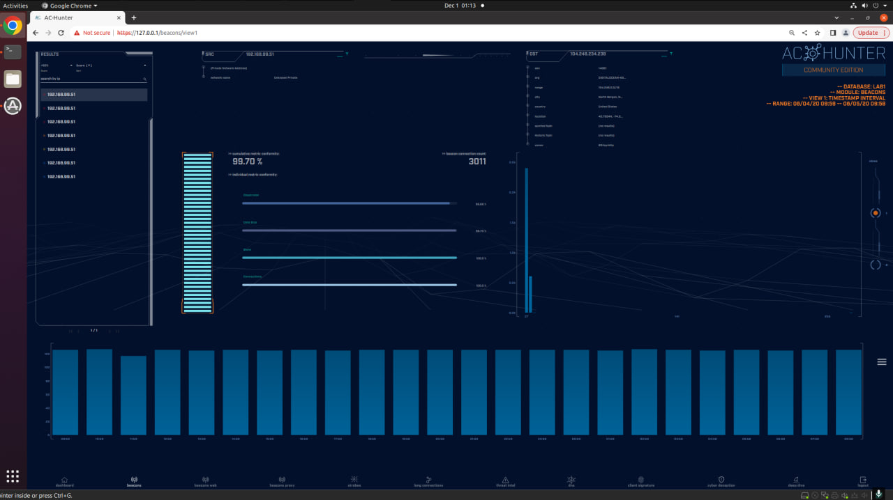
### Отделим подозрительные адреса от легитимных с помощью safelist
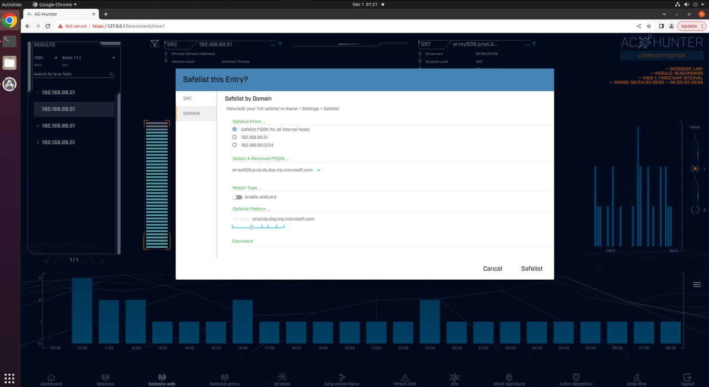
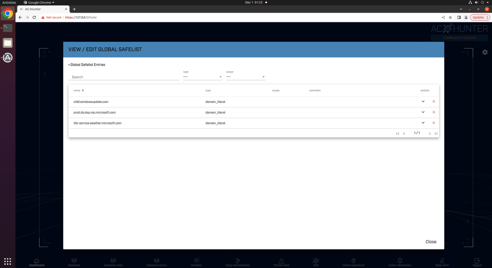
### Подозрительные адреса 
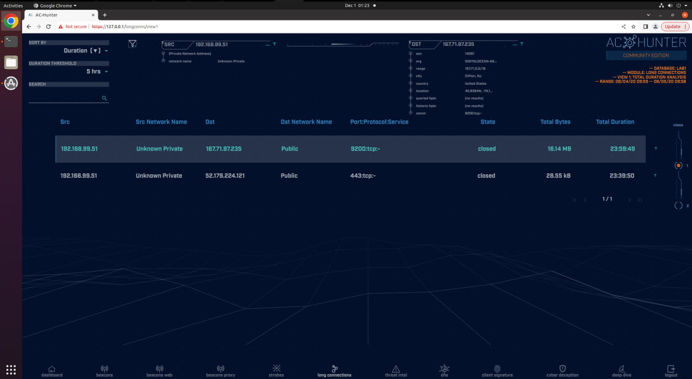
### Сканирование с помощью VirusTotal
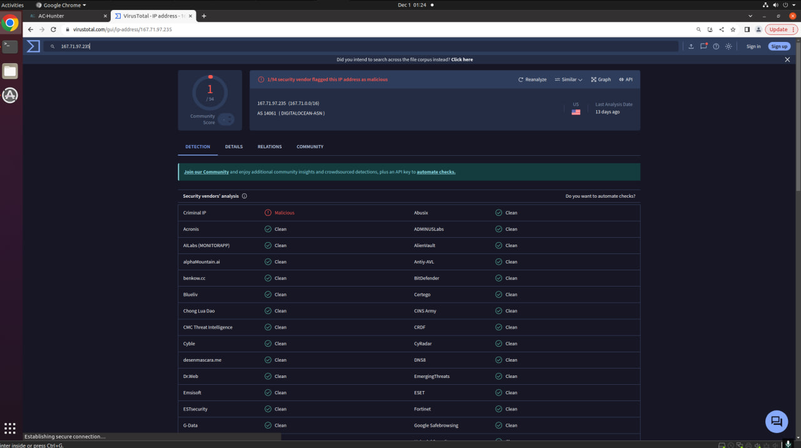
- Открыв первую запись видим сразу предупреждение
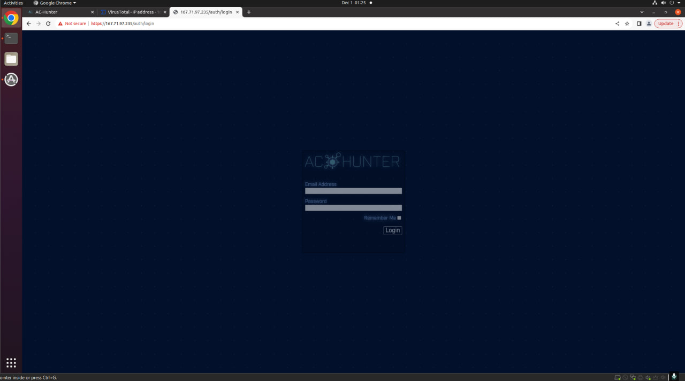
- Перейдя по нему, мы видем окно лаборатории к в самом начале
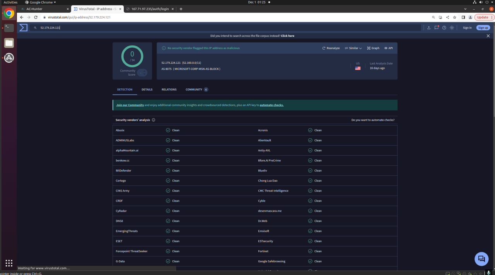
- Virustotal не обнаружил ничего подозрительного
### Просмотрим логи 2го адреса
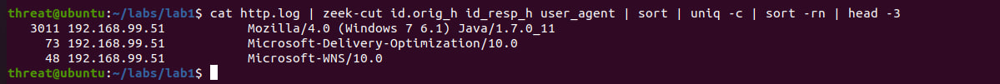
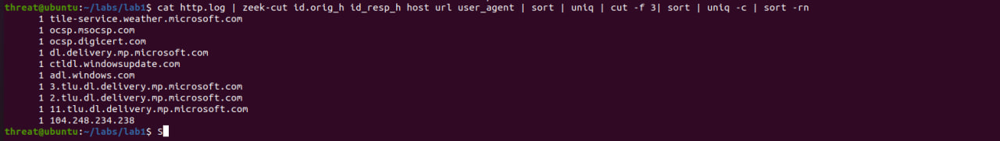
После проведённого анализа удалось установить следующее:
- a) Общее количество соединений составило 3011.
- b) Строка URI имеет сложный и запутанный вид.

Вывод: Соединения с адресом 104.248.234.238 явно нелегитимны.