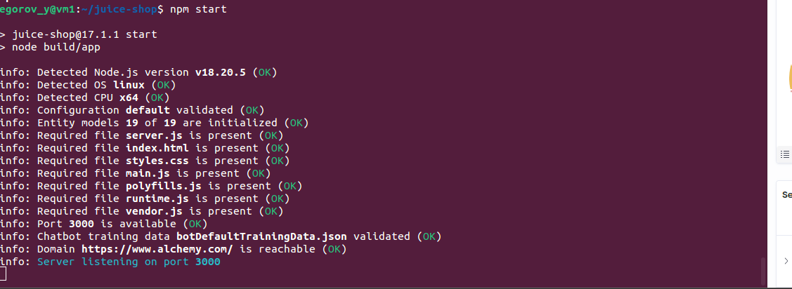
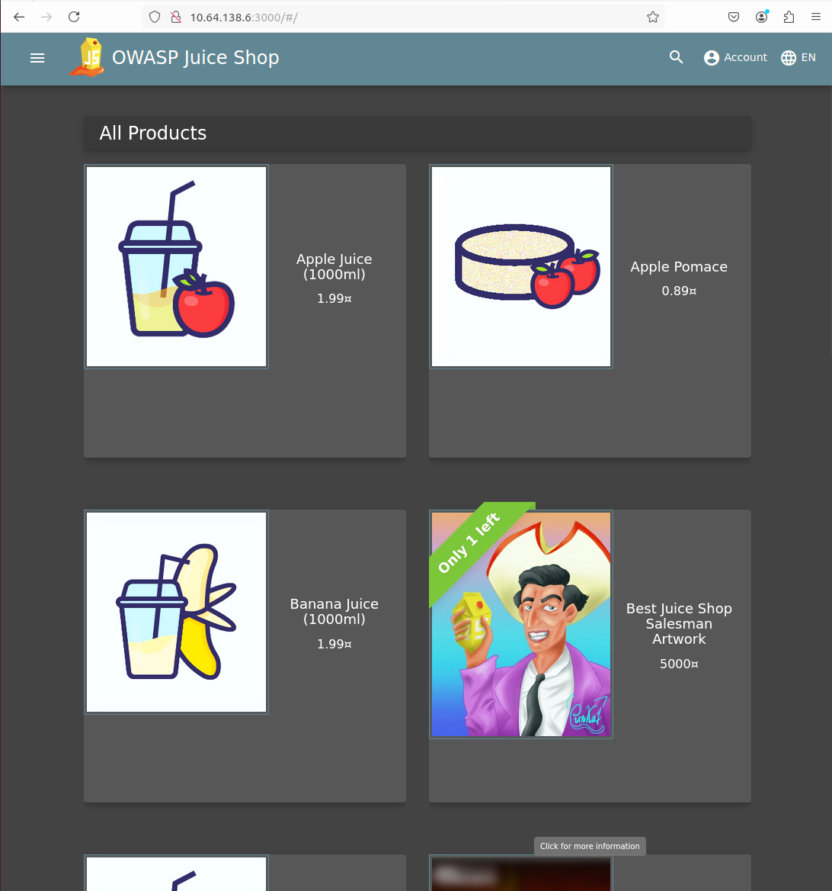
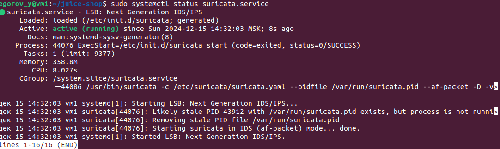
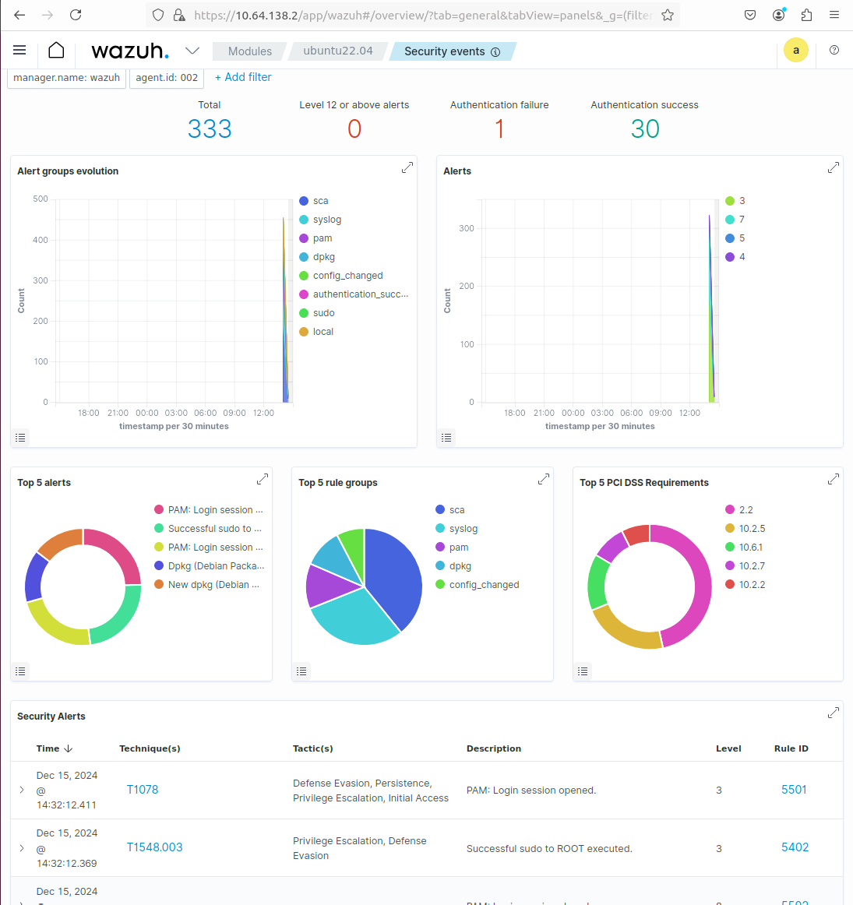
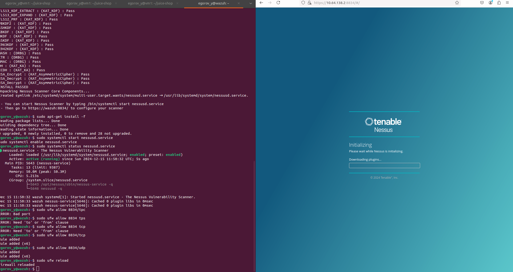
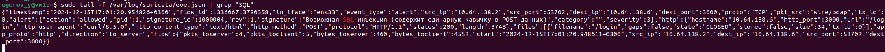

# Практическая работа 5

## Выполнил: студент группы ББМО-01-23 Егоров Ю.А.

---

## Сетевая инфраструктура

| **VM**       | **Роль**                         | **IP-адрес** |
|--------------|---------------------------------|------------------|
| **VM1**      | OWASP Juice Shop, Suricata IDS  | 10.64.138.6      |
| **VM2**      | Wazuh SIEM, Nessus Scanner      | 10.64.138.2      |

---

## Описание тестовой инфраструктуры

- **VM1** (на 10.64.138.6) запущено уязвимое приложение [OWASP Juice Shop](https://owasp.org/www-project-juice-shop/) и **Suricata IDS**.
- **VM2** (на 10.64.138.2) развернута SIEM система **Wazuh** и сканер уязвимостей **Nessus**.

---

## Скриншоты **VM1** (10.64.138.6)

### 1. Запуск OWASP Juice Shop

### 2. OWASP Juice Shop в браузере

### 3. Статус Suricata IDS

---

## Скриншоты **VM2** (10.64.138.2)

### 4. Общий обзор Wazuh

### 5. Процесс инициализации Nessus

### 6. Результаты сканирования Nessus

---

## Проверка детекции уязвимостей

### SQL иньекция

- **Поставленная задача**: детекция SQL-иньекции в POST-запросах.
- **Suricata** зарегистрировала атаку и логировала событие.

**Скриншот лога Suricata**

---

## Рекомендации по повышению безопасности приложения

1. **Обновление и патчинг**:
   - Регулярно обновляйте серверное ПО и все зависимости приложения.
   - Периодически сканируйте на наличие уязвимостей с помощью **Nessus**.

2. **Валидация ввода данных**:
   - Реализуйте строгую валидацию входных данных на стороне сервера.
   - Используйте параметризованные запросы для защиты от SQL-инъекций.

3. **Включение веб-фаервола (WAF)**:
   - Используйте решения типа **ModSecurity** или других WAF для фильтрации опасных запросов.

4. **Ограничение HTTP-методов**:
   - Разрешите только необходимые HTTP-методы (GET, POST) и заблокируйте PUT, DELETE и др., если они не используются.

5. **Журналирование и мониторинг**:
   - Настройте детальное логирование всех событий.
   - Интегрируйте логи с **SIEM**-системами для постоянного мониторинга и анализа угроз.

6. **Защита от XSS и CSRF**:
   - Внедрите фильтрацию и экранирование вывода для защиты от **XSS** атак.
   - Используйте **CSRF-токены** для предотвращения CSRF атак.

7. **Ограничение доступа по IP**:
   - Ограничьте доступ к административной панели и критическим ресурсам по IP-адресам.

8. **Шифрование данных**:
   - Используйте HTTPS с актуальными сертификатами SSL/TLS для шифрования трафика.
   - Шифруйте чувствительные данные на уровне базы данных.

9. **Разделение привилегий**:
   - Ограничьте права доступа для сервисов и пользователей в системе.
   - Применяйте минимально необходимые привилегии.

10. **Периодическое тестирование на безопасность**:
    - Проводите регулярные **пентесты** и проверки на уязвимости.

---

## Выводы
- **Suricata** детектирует уязвимости на VM1 и передаёт их в логи.
- **Nessus** обнаружил уязвимости и составил отчёт об их критичности.
