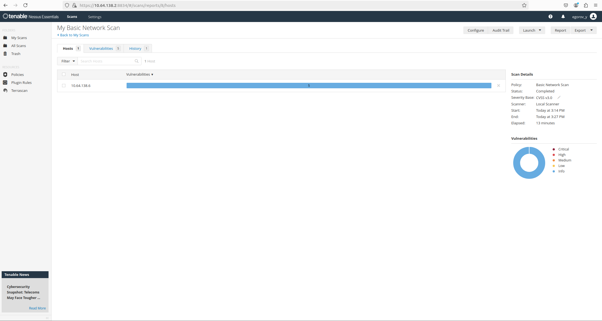

# Практическая работа 5

## Выполнил: студент группы ББМО-01-23 Егоров Ю.А.

---

## Сетевая инфраструктура

| **VM**       | **Роль**                         | **IP-адрес** |
|--------------|---------------------------------|------------------|
| **VM1**      | OWASP Juice Shop, Suricata IDS  | 10.64.138.6      |
| **VM2**      | Wazuh SIEM, Nessus Scanner      | 10.64.138.2      |

---

## Описание тестовой инфраструктуры

- **VM1** (на 10.64.138.6) запущено уязвимое приложение [OWASP Juice Shop](https://owasp.org/www-project-juice-shop/) и **Suricata IDS**.
- **VM2** (на 10.64.138.2) развернута SIEM система **Wazuh** и сканер уязвимостей **Nessus**.

---

## Скриншоты **VM1** (10.64.138.6)

### 1. Запуск OWASP Juice Shop

### 2. OWASP Juice Shop в браузере

### 3. Статус Suricata IDS

---

## Скриншоты **VM2** (10.64.138.2)

### 4. Общий обзор Wazuh

### 5. Процесс инициализации Nessus

### 6. Результаты сканирования Nessus

---

## Проверка детекции уязвимостей

### SQL иньекция

- **Поставленная задача**: детекция SQL-иньекции в POST-запросах.
- **Suricata** зарегистрировала атаку и логировала событие.

**Скриншот лога Suricata**

